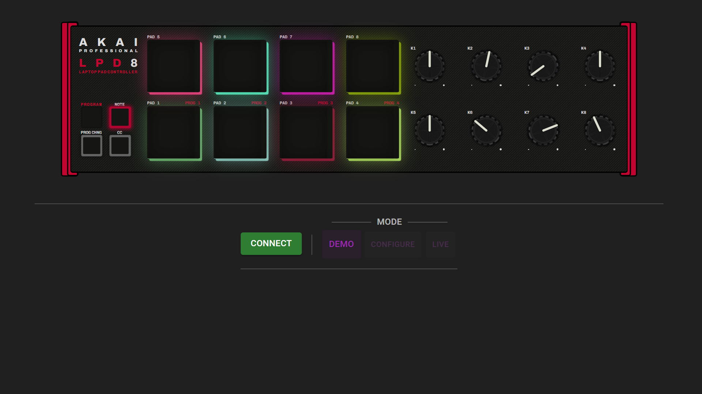

# LPD8mk2

A visually responsive interface for the [LPD8 mk2](https://www.akaipro.com/lpd8-mk2.html).

[Demo](https://mutx.github.io/lpd8mk2/)

## About

This project aims to be a free alternative to the program editor provided by AKAI (which requires an account to download), as well as to improve upon some other aspects, such as,

- An interactive and visually responsive LPD8 mk2.
- Redesign adhering to the [Material UI](https://material.io) standard.
- Added features for configurability of LPD8 mk2 hardware settings.
- Provide a full virtual experience with basic DAW functionality in future iterations.

## Dependencies
- [NodeJS/npm](https://nodejs.org/en)
- [WebMIDI enabled browser](https://developer.mozilla.org/en-US/docs/Web/API/Web_MIDI_API#browser_compatibility) (most Chromium based browsers will work)

## Install
1. Download/clone the repository into a local folder.
2. Navigate to the local folder in your terminal using `cd folderPath`.
3. Run `npm install` to install dependencies.

## Run
1. Run `npm run dev` to start your local development server. No build required.
2. Enter the local host address `http://localhost:XXXX/` (shown in the terminal) into your browser. 

## Build
1. Run `npm run build` to build the static content.
2. Run `npm run preview` to test the build.
3. The build output will be in the `dist` folder, which is created in the working directory where the build command was run.

## Refactoring

This project is currently being refactored onto [React](https://react.dev) using [MUI](https://mui.com) and [JSX](https://facebook.github.io/jsx/).

## License

[Creative Commons Attribution-NonCommercial-ShareAlike (CC-BY-NC-SA)](http://creativecommons.org/licenses/by-nc-sa/4.0/)

A creative commons license that bans commercial use and requires you to release any modified works under this license.
